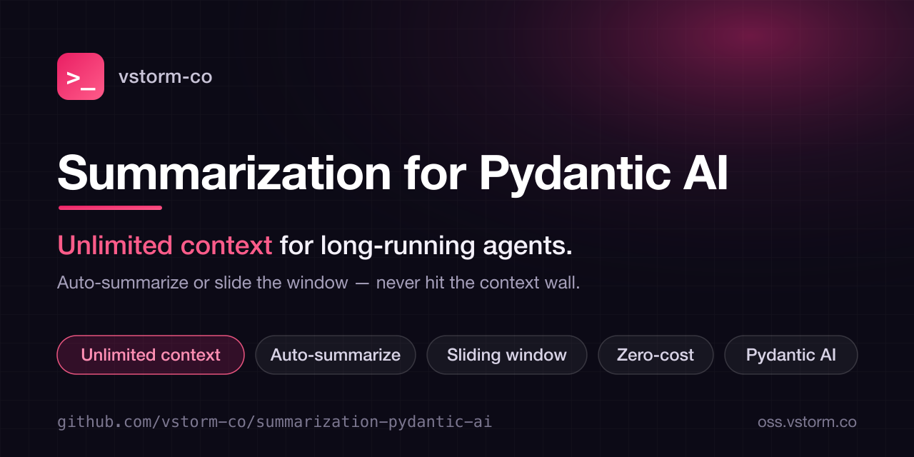

<p align="center">
  
</p>

<h1 align="center">Summarization for Pydantic AI</h1>

<p align="center">
  <b>Unlimited context for long-running agents.</b><br>
  Auto-summarize or slide the window — never hit the context wall.
</p>

<p align="center">
  <a href="https://vstorm-co.github.io/summarization-pydantic-ai/">Docs</a> &middot;
  <a href="https://pypi.org/project/summarization-pydantic-ai/">PyPI</a> &middot;
  <a href="#installation">Install</a> &middot;
  <a href="#vstorm-oss-ecosystem">Ecosystem</a> &middot;
  <a href="https://github.com/vstorm-co/pydantic-deepagents">Deep Agents</a>
</p>

<p align="center">
  <a href="https://pypi.org/project/summarization-pydantic-ai/"></a>
  <a href="https://pepy.tech/projects/summarization-pydantic-ai"></a>
  <a href="https://github.com/vstorm-co/summarization-pydantic-ai/stargazers"></a>
  <a href="https://www.python.org/downloads/"></a>
  <a href="https://opensource.org/licenses/MIT"></a>
  <a href="https://coveralls.io/github/vstorm-co/summarization-pydantic-ai?branch=main"></a>
  <a href="https://github.com/vstorm-co/summarization-pydantic-ai/actions/workflows/ci.yml"></a>
  <a href="https://github.com/pydantic/pydantic-ai"></a>
</p>

<p align="center">
  <b>LLM summarization</b> &nbsp;&bull;&nbsp; <b>Zero-cost sliding window</b> &nbsp;&bull;&nbsp; <b>Auto token tracking</b> &nbsp;&bull;&nbsp; <b>Limit warnings</b> &nbsp;&bull;&nbsp; <b>Safe tool-pair cutoff</b>
</p>

---

> **Part of [Pydantic Deep Agents](https://github.com/vstorm-co/pydantic-deepagents)** — the open-source Claude Code alternative & Python agent framework. Use this library standalone, or get everything wired together in one `create_deep_agent()` call.

**Summarization for Pydantic AI** keeps your [Pydantic AI](https://ai.pydantic.dev/) agents running through long conversations without ever exceeding model context limits. Choose intelligent LLM summarization or zero-cost sliding-window trimming — both preserve tool-call pairs.

## Use Cases

| What You Want to Build | How This Library Helps |
|------------------------|------------------------|
| **Long-Running Agent** | Automatically compress history when context fills up |
| **Customer Support Bot** | Preserve key details while discarding routine exchanges |
| **Code Assistant** | Keep recent code context, summarize older discussions |
| **High-Throughput App** | Zero-cost sliding window for maximum speed |
| **Cost-Sensitive App** | Choose between quality (summarization) or free (sliding window) |

## Installation

```bash
pip install summarization-pydantic-ai
```

Or with uv:

```bash
uv add summarization-pydantic-ai
```

For accurate token counting:

```bash
pip install summarization-pydantic-ai[tiktoken]
```

## Quick Start — Capabilities (Recommended)

The recommended way to add context management is via pydantic-ai's native [Capabilities API](https://ai.pydantic.dev/capabilities/):

```python
from pydantic_ai import Agent
from pydantic_ai_summarization import ContextManagerCapability

agent = Agent(
    "anthropic:claude-sonnet-4-6",
    capabilities=[ContextManagerCapability(max_tokens=100_000)],
)

result = await agent.run("Hello!")
```

**That's it.** Your agent now:

- Tracks token usage on every turn
- Auto-compresses when approaching the limit (90% by default)
- Truncates large tool outputs
- Auto-detects context window size from the model
- Preserves tool call/response pairs (never breaks them)

### Agent-Triggered Compression

Let the agent decide when to compress by enabling the `compact_conversation` tool:

```python
agent = Agent(
    "anthropic:claude-sonnet-4-6",
    capabilities=[ContextManagerCapability(
        include_compact_tool=True,  # Adds compact_conversation(focus?) tool
    )],
)
```

The agent can call `compact_conversation(focus="preserve API design decisions")` to trigger compression with a focus topic. Compression is deferred to the next model request.

### Combine with Limit Warnings

```python
from pydantic_ai_summarization import ContextManagerCapability, LimitWarnerCapability

agent = Agent(
    "openai:gpt-4.1",
    capabilities=[
        LimitWarnerCapability(max_iterations=40, max_context_tokens=100_000),
        ContextManagerCapability(max_tokens=100_000),
    ],
)
```

### Alternative: Processor API

For standalone use without capabilities:

```python
from pydantic_ai import Agent
from pydantic_ai_summarization import create_summarization_processor

processor = create_summarization_processor(
    trigger=("tokens", 100000),
    keep=("messages", 20),
)

agent = Agent("openai:gpt-4.1", history_processors=[processor])
```

## Available Processors

| Processor | LLM Cost | Latency | Context Preservation |
|-----------|----------|---------|---------------------|
| `ContextManagerCapability` | Per compression | Low tracking | Intelligent summary + tool truncation |
| `SummarizationProcessor` | High | High | Intelligent summary |
| `SlidingWindowProcessor` | Zero | ~0ms | Discards old messages |
| `LimitWarnerProcessor` | Zero | ~0ms | Full history + warning injection |

### Intelligent Summarization

Uses an LLM to create summaries of older messages:

```python
from pydantic_ai_summarization import create_summarization_processor

processor = create_summarization_processor(
    trigger=("tokens", 100000),  # When to summarize
    keep=("messages", 20),       # What to keep
)
```

### Zero-Cost Sliding Window

Simply discards old messages — no LLM calls:

```python
from pydantic_ai_summarization import create_sliding_window_processor

processor = create_sliding_window_processor(
    trigger=("messages", 100),  # When to trim
    keep=("messages", 50),      # What to keep
)
```

### Limit Warnings

Warn the agent before requests, context usage, or total tokens hit a cap:

```python
from pydantic_ai_summarization import create_limit_warner_processor

processor = create_limit_warner_processor(
    max_iterations=40,
    max_context_tokens=100000,
    max_total_tokens=200000,
)
```

### Context Manager Capability

Full context management with token tracking, auto-compression, and tool output truncation:

```python
from pydantic_ai import Agent
from pydantic_ai_summarization import ContextManagerCapability

agent = Agent(
    "anthropic:claude-sonnet-4-6",
    capabilities=[ContextManagerCapability(
        max_tokens=100_000,
        compress_threshold=0.9,
        max_tool_output_tokens=5000,
        include_compact_tool=True,  # Agent gets a compact_conversation tool
    )],
)
```

## Trigger Types

| Type | Example | Description |
|------|---------|-------------|
| `messages` | `("messages", 50)` | Trigger when message count exceeds threshold |
| `tokens` | `("tokens", 100000)` | Trigger when token count exceeds threshold |
| `fraction` | `("fraction", 0.8)` | Trigger at percentage of max_input_tokens |

## Keep Types

| Type | Example | Description |
|------|---------|-------------|
| `messages` | `("messages", 20)` | Keep last N messages |
| `tokens` | `("tokens", 10000)` | Keep last N tokens worth |
| `fraction` | `("fraction", 0.2)` | Keep last N% of context |

## Advanced Configuration

### Multiple Triggers

```python
from pydantic_ai_summarization import SummarizationProcessor

processor = SummarizationProcessor(
    model="openai:gpt-4o",
    trigger=[
        ("messages", 50),    # OR 50+ messages
        ("tokens", 100000),  # OR 100k+ tokens
    ],
    keep=("messages", 10),
)
```

### Fraction-Based

```python
processor = SummarizationProcessor(
    model="openai:gpt-4o",
    trigger=("fraction", 0.8),  # 80% of context window
    keep=("fraction", 0.2),     # Keep last 20%
    max_input_tokens=128000,    # GPT-4's context window
)
```

### Custom Token Counter

```python
def my_token_counter(messages):
    return sum(len(str(msg)) for msg in messages) // 4

processor = create_summarization_processor(
    token_counter=my_token_counter,
)
```

### Custom Model (e.g., Azure OpenAI)

```python
from pydantic_ai.models.openai import OpenAIModel
from pydantic_ai.providers.openai import OpenAIProvider
from pydantic_ai_summarization import create_summarization_processor

azure_model = OpenAIModel(
    "gpt-4o",
    provider=OpenAIProvider(
        base_url="https://my-resource.openai.azure.com/openai/deployments/gpt-4o",
        api_key="your-azure-api-key",
    ),
)

processor = create_summarization_processor(
    model=azure_model,
    trigger=("tokens", 100000),
    keep=("messages", 20),
)
```

### Custom Summary Prompt

```python
processor = create_summarization_processor(
    summary_prompt="""
    Extract key information from this conversation.
    Focus on: decisions made, code written, pending tasks.

    Conversation:
    {messages}
    """,
)
```

## Why Choose This Library?

| Feature | Description |
|---------|-------------|
| **Two Strategies** | Intelligent summarization or fast sliding window |
| **Flexible Triggers** | Message count, token count, or fraction-based |
| **Safe Cutoff** | Never breaks tool call/response pairs |
| **Auto max_tokens** | Auto-detect context window from genai-prices |
| **Message Persistence** | Save all messages to JSON for session resume |
| **Guided Compaction** | Focus summaries on specific topics |
| **Callbacks** | on_before/after_compress with instruction re-injection |
| **Async Token Counting** | Sync or async token counter support |
| **Token Tracking** | Real-time usage monitoring with callbacks |
| **Tool Truncation** | Automatic truncation of large tool outputs |
| **Custom Models** | Use any pydantic-ai Model (Azure, custom providers) |
| **Lightweight** | Only requires pydantic-ai-slim (no extra model SDKs) |

## Vstorm OSS Ecosystem

This library is one piece of a broader open-source toolkit for production AI agents — all built on **[Pydantic AI](https://github.com/pydantic/pydantic-ai)**.

| Project | Description | Stars |
|---------|-------------|:-----:|
| **[Pydantic Deep Agents](https://github.com/vstorm-co/pydantic-deepagents)** | The full agent framework **and** terminal assistant — bundles every library below into one `create_deep_agent()` call. | [](https://github.com/vstorm-co/pydantic-deepagents) |
| **[pydantic-ai-backend](https://github.com/vstorm-co/pydantic-ai-backend)** | Sandboxed execution & file tools — State / Local / Docker / Daytona backends + console toolset. | [](https://github.com/vstorm-co/pydantic-ai-backend) |
| **[subagents-pydantic-ai](https://github.com/vstorm-co/subagents-pydantic-ai)** | Declarative multi-agent orchestration — sync / async / auto, with token tracking. | [](https://github.com/vstorm-co/subagents-pydantic-ai) |
| 👉 **[summarization-pydantic-ai](https://github.com/vstorm-co/summarization-pydantic-ai)** | Unlimited context for long-running agents — summarization or sliding window. | [](https://github.com/vstorm-co/summarization-pydantic-ai) |
| **[pydantic-ai-shields](https://github.com/vstorm-co/pydantic-ai-shields)** | Drop-in guardrails — cost caps, prompt-injection defense, PII & secret redaction, tool blocking. | [](https://github.com/vstorm-co/pydantic-ai-shields) |
| **[pydantic-ai-todo](https://github.com/vstorm-co/pydantic-ai-todo)** | Task planning with subtasks, dependencies, and cycle detection. | [](https://github.com/vstorm-co/pydantic-ai-todo) |
| **[full-stack-ai-agent-template](https://github.com/vstorm-co/full-stack-ai-agent-template)** | Zero to production AI app in 30 minutes — FastAPI + Next.js 15, RAG, 6 AI frameworks. | [](https://github.com/vstorm-co/full-stack-ai-agent-template) |

> **Want it all wired together?** [Pydantic Deep Agents](https://github.com/vstorm-co/pydantic-deepagents) ships every library above integrated — planning, filesystem, subagents, memory, context management, and guardrails — behind a single function call. Browse everything at [oss.vstorm.co](https://oss.vstorm.co).


## Contributing

```bash
git clone https://github.com/vstorm-co/summarization-pydantic-ai.git
cd summarization-pydantic-ai
make install
make test  # 100% coverage required
```

## Star History

If this library saved you from wiring an agent harness by hand — **[give it a ⭐](https://github.com/vstorm-co/summarization-pydantic-ai)**. It's the single biggest thing that helps the project grow.

<p align="center">
  <a href="https://www.star-history.com/#vstorm-co/summarization-pydantic-ai&type=date">
    
  </a>
</p>

---

## License

MIT — see [LICENSE](LICENSE)

---

<div align="center">

### Need help shipping AI agents in production?

<p>We're <a href="https://vstorm.co"><b>Vstorm</b></a> — an Applied Agentic AI Engineering Consultancy<br>with 30+ production agent implementations. <a href="https://github.com/vstorm-co/pydantic-deepagents"><b>Pydantic Deep Agents</b></a> is what we build them with.</p>

<a href="https://vstorm.co/contact-us/">
  
</a>

<br><br>

Made with **care** by <a href="https://vstorm.co"><b>Vstorm</b></a>

</div>
